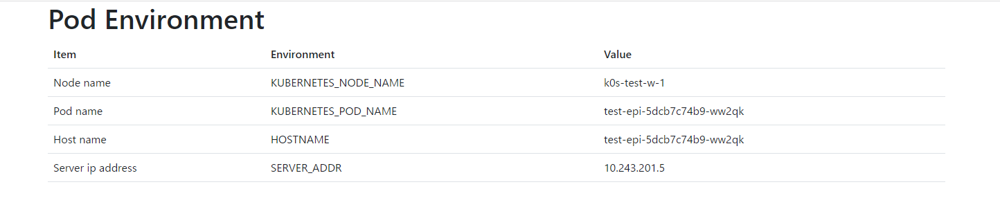

# 概要
Kubernetesで実行すると、Pod名・ホスト名・IPアドレス等をhttpで出力します。  
0.5秒に1回表示されている情報を更新して、0.1秒以内に応答がないとオフライン表示に変わります。  

# URL
https://github.com/irumaru/echo-pod-info  
https://hub.docker.com/r/irumaru/echo-pod-info

# 使用例
http://192.168.10.12:30000/index.php


# 使用方法
##yaml
```
apiVersion: apps/v1
kind: Deployment
metadata:
  name: test-epi
  labels:
    app: epi
spec:
  replicas: 2
  selector:
    matchLabels:
      app: epi
  template:
    metadata:
      labels:
        app: epi
    spec:
      containers:
      - name: epi
        image: irumaru/echo-pod-info:0.4.0
        env:
        - name: KUBERNETES_NODE_NAME
          valueFrom:
            fieldRef:
              fieldPath: spec.nodeName
        - name: KUBERNETES_POD_NAME
          valueFrom:
            fieldRef:
              fieldPath: metadata.name
        ports:
         - containerPort: 80
---
apiVersion: v1
kind: Service
metadata:
  name: test-epi-srv
spec:
  type: NodePort
  externalTrafficPolicy: Local
  selector:
    app: epi
  ports:
    - protocol: TCP
      port: 80
      targetPort: 80
      nodePort: 30000
```

## 要点の説明

#### KubernetesのDownloadAPIを使用して以下の環境変数へ値を取り込んでいます。
```
KUBERNETES_NODE_NAME
KUBERNETES_POD_NAME
```

#### ノードをまたぐバランシングを行わないようにします。
```
externalTrafficPolicy: Local
```
